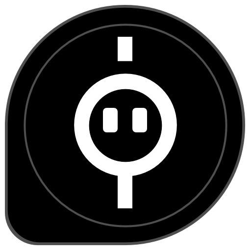
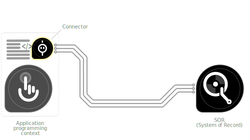

# Connection

## Use Case
System of Record (SOR) integration1 is a common requirement found in the context of digital transformation. That is because pieces of business information often remain distributed across multiple systems—although it is required to allow access to such data through a single system or/and in a unified format. 

1 _Most common examples of this include connecting systems such as enterprise resource planning (ERP), customer relationship management (CRM), human resource management (HRM) systems and existing legacy data sources for the same purpose mentioned above._

Connecting an application to a SOR also includes non-functional, secondary technical elements from a business domain perspective. For example, different systems employ business data models, schemas and functions that are unique to them. Also, the security and communication protocols they utilise can be different from one another. Therefore, connecting such systems requires a certain amount of domain context knowledge beyond the scope of your usual software development territory and continuous commitment to remain compliant with dependencies.

## Solution
There are many ways to address this, such as using a piece of custom middleware to connect each SOR or/and using a centralised solution such as a data warehouse to store the data retrieved from many SORs. However, the most common approach for this is to use a **connector** due to a few good reasons partially discussed above.

A connector simplifies the connection between the SOR and the application that exchanges data with the SOR by providing a layer of abstraction. This idea helps separate secondary technical functions (i.e. security, network communication) from business domain functions. 

### In the context of Software
The party who provides a connector is responsible for maintaining it and ensuring continuous compliance with the SOR. That allows the application developer to focus on the application logic and not worry about the technical details of the SOR. In ideal scenarios, the connector providers would also supply libraries/SDKs for multiple technological stacks.
 

