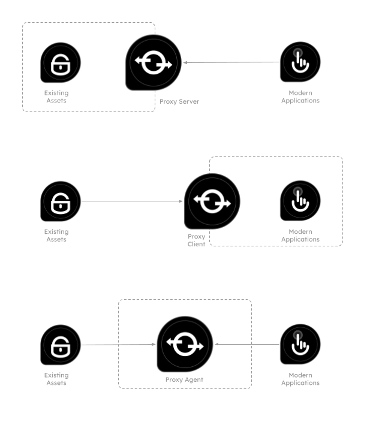

# Proxy

## Use Case
Consumption of existing computing capabilities1 with modern software applications requires standardisation, open access and unification of those based on business functions. Revamping such existing assets to meet the latest standards or developing new assets to replace them is costly, time-consuming and does not bring significant value from a business perspective. More importantly, there is always a possibility that the latest set of standards in the application development industry today could get easily replaced by a new set of standards tomorrow.

1 _software assets, hardware assets, data assets, etc._

## Solution 
As a solution, it is possible to introduce an **intermediary component** to facade the existing2 assets and provide a unified interface to modern applications. This intermediary component is called a **proxy**. The actual implementation of the proxy can be a software component, a hardware component, a virtual machine, a container or something similar. A proxy can also exist in different forms, such as a proxy server, a proxy client, a proxy agent, etc.

2 _old, legacy, non-standard, etc._

.