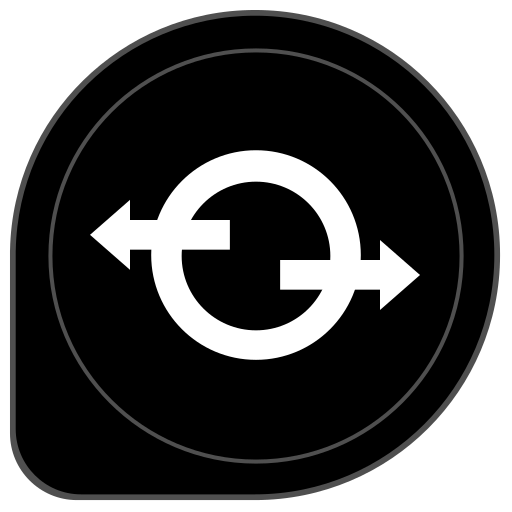
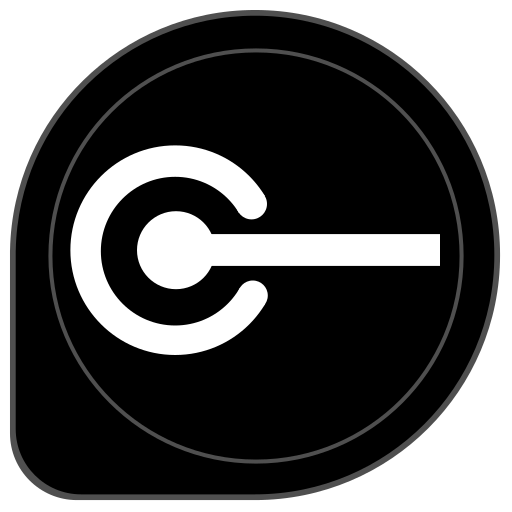

# Service Chaining

|Icon   |Name    |Description
|-------|:------:|----|
||Application| Any type of a software application that acts as a client of the services, systems, assets exposed by a provider|
||Proxy| An intermediary component that facades  existing assets to provide a unified interface to modern applications. Please refer to [proxy pattern](./proxy.md) for further details.|
||Service Endpoint| This includes all possible backend systems including but not limited to Legacy Applications, Web Services, APIs, SoR *(e.g. CRM, ERP)* and Databases.|

## Use Case
Organisations have access to a variety of digital assets1 that provide the basic building block functionalities of their businesses. However, it is often required to connect a chosen set of functions of such assets in a specific, sequential order to achieve complex service delivery requirements. This is mainly because of the demand for agility that comes from the business side.

1_Internal software systems, SoR,  Partner systems, Device APIs etc_

## Solution
The proposed solution is generally referred to as Service Chaining. In simple terms, Service chaining is the idea of connecting multiple network service endpoints in a **specific sequence** to form a logical chain of services that produces a single outcome by consuming responses of different services.

The most common way of implementing this is through a proxy service built as a micro-service, serverless function or a piece of middleware. The **processing** steps depicted in the above diagram may include any relevant action such as data caching, transformation, enrichment and aggregation.

Service Chaining can be treated as a subset of Service Orchestration. It represents the idea of sequential communication with service endpoints, whereas the generic term Service Orchestration may include all other styles such as parallel-invocation and recepients-list style communication.
