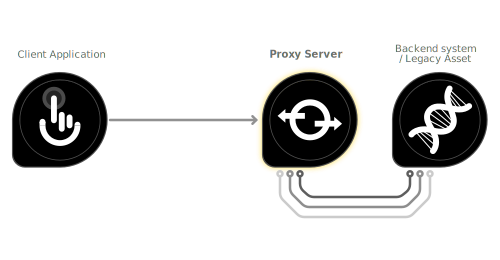

# Proxy

|Icon   |Name    |Description
|-------|:------:|----|
||Proxy| An intermediary component that facades  existing assets to provide a unified interface to modern applications.|
||Application| Any type of a software application that acts as a client of the services, systems, assets exposed by a provider|
||Legacy Application| Typically, an existing asset that was designed to serve a certain business purpose with less (or no) focus on integration with other systems.|

## Use Case
Consumption of existing computing capabilities1 with modern software applications requires standardisation, open access and unification of those based on business functions. Revamping such existing assets to meet the latest standards or developing new assets to replace them is costly, time-consuming and does not bring significant value from a business perspective. More importantly, there is always a possibility that the latest set of standards in the application development industry today could get easily replaced by a new set of standards tomorrow.

1 _software assets, hardware assets, data assets, etc._

## Solution 
As a solution, it is possible to introduce an **intermediary component** to facade the existing2 assets and provide a unified interface to modern applications. This intermediary component is called a **proxy**. The actual implementation of the proxy can be a software component, a hardware component, a virtual machine, a container or something similar. A proxy can also exist in different forms, such as a proxy server, a proxy client, a proxy agent, etc.

2 _old, legacy, non-standard, etc._

.
### A few examples (In thew context of Software)
|...   |Description|
|-----------:|----|
|**Security Proxy**|A proxy is used to control access to a sensitive asset by acting as a gatekeeper. It checks the permission levels and credentials of the client before allowing access to the real asset.|
|**Anonymous proxy**| This allows users/apps to perform certain functions while concealing their identity and location. It acts as an intermediary between the client's device and the target back end asset, making requests on behalf of either party. In adition to the common example of internet browsing proxy that internet users use very often, this pattern also applies in other contexts such as Taxi Apps that connect taxi drivers and users with temporary proxy mobile numbers that conceal their identities.|
|**Virtual Proxy**| This is a case where a proxy acts as a placeholder for a certain functional asset. This is helpful when the actual functional asset is known to be heavily resource-intensive. The virtual proxy maintains the connections until the actual instances of the actual asset is created on-demand and simply routes the traffic to the actual asset by initiating an instance on demand.|
|**Remote Proxy**| This is used to have a local representation of an asset located in a remote location (e.g: a remote server). The proxy acts as a surrogate here, enabling the client to interact with the remote object as if it were local while abstrcting the communication complexities.|
|**Router Proxy**| Dynamic Routing (e.g: Header-based Routing, Content-base Routing) is common requirement. A proxy can be used effectivly to perform this with a great level of agility.|
|**Logging Proxy**| A logging proxy keeps a log of action requests made to an actual asset that it fronts. It can be useful for debugging, auditing, statistics and monetisation. The logging proxy intercepts action requests made by clients, logs the relevant information, and then forwards the requests to the actual assets.|
|**Cache Proxy**| This provides a temporary storage for same requests in order to minimise the execution of expensive operations. When a client applicaiton makes a request to a back end asset through a cache-proxy, the proxy stores the results returned by the back end asset. Then the proxy used the stored data to serve subsequent identical requests, eliminating the need to recompute the result at the back end. This helps reducing the load on the back end assets. Also, in cases where you have to pay an external party that provides these backend assets, it eliminates the need to repeat payments to retrieve the data that you have already paid for.|

